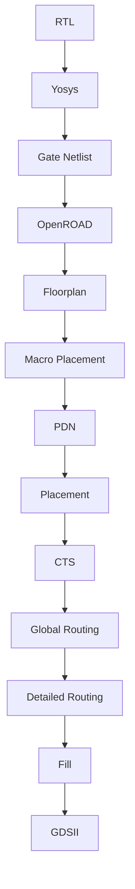

# Archgen Hiring Assignment – RTL-to-GDSII Implementation of Ariane133

> **Submitted by:** Kiran Kumar Siripurapu

---

## Introduction

This repository presents my implementation of the Archgen Hiring Assignment. The objective was to implement the **Ariane133** processor from the ChiPBench benchmark using the **OpenROAD** open-source ASIC physical design flow on the **Nangate45** technology.

The project involved building and configuring the complete RTL-to-GDSII implementation flow using open-source EDA tools, starting from the provided RTL and timing constraints.

## Project Objectives

- Implement the provided Ariane133 RTL using the OpenROAD physical design flow.
- Configure the design for the Nangate45 / FreePDK45 technology.
- Apply the required timing constraints for a target operating frequency of **450 MHz**.
- Perform synthesis, floorplanning, placement, clock tree synthesis, global routing, detailed routing, and final layout generation.
- Analyze the implementation results and document the issues encountered and solutions applied.

## Development Environment & Toolchain

The complete physical design flow was implemented on **Ubuntu 24.04 (WSL2)** using the **Nix development environment**, which provides all required EDA tools.

### Toolchain

| Tool | Purpose |
|------|---------|
| OpenROAD | Physical Design Flow |
| OpenROAD-flow-scripts | Complete RTL-to-GDSII Automation |
| Yosys | RTL Synthesis |
| OpenSTA | Static Timing Analysis |
| TritonRoute / FastRoute | Routing |
| KLayout | GDSII Visualization |
| Nangate45 / FreePDK45 | Technology Library |

## Project Structure

```text
Archgen-Hiring/
├── constraints/
│   ├── ariane_450mhz.sdc          # Timing constraints
│   ├── io.tcl                     # IO placement constraints
│   └── physical_hints.tcl         # Physical design hints
│
├── rtl/
│   ├── ariane.sv2v.v             # Flattened Ariane133 RTL
│   ├── macros.v                  # SRAM wrapper modules
│   └── LICENSE
│
├── flow/
│   ├── designs/nangate45/archgen/
│   │   ├── config.mk             # OpenROAD design configuration
│   │   └── ariane_450mhz.sdc
│
├── results/                      # Generated implementation databases
├── reports/                      # Timing and implementation reports
└── logs/                         # Flow logs
```

## Design Constraints

The implementation used the provided timing and physical constraints as a starting point.

| Parameter | Value |
|-----------|------:|
| Top Module | `ariane` |
| Target Frequency | **450 MHz** |
| Clock Period | **2.222 ns** |
| Input / Output Delay | **0.444 ns** (20%) |
| Technology | Nangate45 / FreePDK45 |
| SRAM Macro | `fakeram45_256x16` |
| Initial Die Area | `0 0 1500 1500` |
| Initial Core Area | `10 12 1448 1448` |

## Physical Design Flow



---

### RTL Synthesis

**Automated Flow Command:**
```bash
make DESIGN_CONFIG=designs/nangate45/archgen/config.mk synth
```

**Manual Exploration (Yosys):**
```tcl
yosys
read_verilog *.v
hierarchy -top ariane -check
synth -top ariane
dfflibmap -liberty /path/to/NangateOpenCellLibrary_typical.lib
abc -liberty /path/to/NangateOpenCellLibrary_typical.lib
write_verilog -noattr -noexpr ariane_mapped.v
```

Synthesis converted the provided Ariane133 RTL into a technology-mapped gate-level netlist using the Nangate45 standard cell library. The RTL inspection revealed that the SRAM wrapper definitions were in `macros.v`. Including `macros.v` during synthesis successfully resolved the missing module references for `SyncSpRamBeNx64`.

---

### OpenROAD Design Initialization

Before floorplanning, the timing libraries, physical libraries (LEF), and timing constraints were loaded. 

**Manual Exploration (OpenROAD Shell):**
```tcl
read_liberty /path/to/NangateOpenCellLibrary_typical.lib
read_liberty /path/to/fakeram45_256x16.lib
read_lef /path/to/NangateOpenCellLibrary.tech.lef
read_lef /path/to/NangateOpenCellLibrary.macro.mod.lef
read_lef /path/to/fakeram45_256x16.lef
read_verilog ariane_mapped.v
link_design ariane
read_sdc constraints/ariane_450mhz.sdc
```

During initialization, the original SDC file `ariane_450mhz.sdc` threw a syntax issue (`[expr]` inside `{}`) which was corrected so OpenSTA could evaluate it properly.

---

### Floorplanning

**Automated Flow Command:**
```bash
make DESIGN_CONFIG=designs/nangate45/archgen/config.mk floorplan
```

**Manual Exploration (OpenROAD Shell):**
```tcl
initialize_floorplan \
    -die_area "0 0 1500 1500" \
    -core_area "10 12 1448 1448" \
    -site FreePDK45_38x28_10R_NP_162NW_34O
```

The die area and core area were initialized as per the physical constraints. Tap cells were inserted throughout the floorplan to prevent latch-up and provide well/substrate connections.

---

### Macro Placement

**Command Used:**
```bash
make DESIGN_CONFIG=designs/nangate45/archgen/config.mk gui_2_2_floorplan_macro
```

The SRAM macros required legal placement aligned to the manufacturing grid before routing. Using the OpenROAD RTL Macro Placer with the required halo and channel spacing constraints ensured all macros were positioned correctly. 


---

### Power Distribution Network (PDN) Generation

The PDN was generated to distribute the power (`VDD`) and ground (`VSS`) supplies to all standard cells and SRAM macros, ensuring stable operation.

---

### Placement

**Automated Flow Command:**
```bash
make DESIGN_CONFIG=designs/nangate45/archgen/config.mk place
```

**Manual Exploration (OpenROAD Shell):**
```tcl
# Place IO pins explicitly before placement
place_pins -hor_layers metal5 -ver_layers metal6 \
    -exclude left:0-500 -exclude left:1000-1500 \
    -exclude right:* -exclude top:* -exclude bottom:*

global_placement
detailed_placement
```

IO pins were placed using the exclusion constraints from `io.tcl`. Afterward, global and detailed placement populated the core area with logic cells, legalizing their positions and minimizing wirelength.


---

### Clock Tree Synthesis (CTS)

**Command Used:**
```bash
make DESIGN_CONFIG=designs/nangate45/archgen/config.mk cts
```

CTS built a balanced clock distribution network. Wire RC parameters were sourced from the Nangate45 platform files to ensure accurate timing analysis during tree construction.


---

### Global Routing

**Command Used:**
```bash
make DESIGN_CONFIG=designs/nangate45/archgen/config.mk grt
```

Global routing generated routing guides for all signal nets. Congestion relaxation (`-allow_congestion`) was enabled to handle the routing density of Ariane133.


---

### Detailed Routing

**Command Used:**
```bash
make DESIGN_CONFIG=designs/nangate45/archgen/config.mk route
```

TritonRoute generated the final legal physical metal wires and vias, adhering to the Nangate45 technology design rules.


---

### Filler Cell Insertion & Density Fill

**Command Used:**
```bash
make DESIGN_CONFIG=designs/nangate45/archgen/config.mk finish
```

Filler cells were inserted into gaps between standard cells to ensure continuity of the well and power rails. Metal density fill was then added to meet manufacturing density rules.

---

### Final Report & GDSII Generation

**Commands Used:**
```bash
make DESIGN_CONFIG=designs/nangate45/archgen/config.mk gui_final
klayout results/nangate45/archgen/base/6_final.gds
```

The fully routed OpenDB database was exported to a standard GDSII layout file.

**Final Layout – OpenROAD GUI:**


**Final GDS – KLayout:**


---

### Static Timing Analysis (STA)

#### Objective

After completing the physical implementation flow, Static Timing Analysis (STA) was performed using OpenSTA to verify whether the implemented design satisfies the required timing constraints.

The analysis was performed using the timing constraints specified in `ariane_450mhz.sdc`:

- Clock Frequency: **450 MHz**
- Clock Period: **2.222 ns**
- Input Delay: **20% of the clock period**
- Output Delay: **20% of the clock period**
- Clock Latency: **0.535 ns**

#### Timing Results

| Parameter | Value |
|-----------|------:|
| Target Frequency | 450 MHz |
| Clock Period | 2.222 ns |
| Worst Negative Slack (WNS) | -1.19 ns |
| Total Negative Slack (TNS) | -3629.72 ns |
| Hold TNS | 0 ns |

#### Observation

The complete RTL-to-GDSII implementation flow was successfully executed using the specified timing constraints. Static timing analysis showed that hold timing requirements were satisfied, while setup timing exhibited a Worst Negative Slack (WNS) of **-1.19 ns** at the target frequency of **450 MHz**.

This indicates that additional timing optimization, such as floorplan refinement, placement optimization, clock tree tuning, or routing optimization, would be required to achieve full setup timing closure at the target operating frequency.

---

## Implementation Results

| Metric | Value |
|--------|-------|
| Target Frequency | 450 MHz |
| Clock Period | 2.222 ns |
| Runtime | 4515 s |
| Peak Memory | 8075 MB |
| Final Design Area | 739,979 µm² |
| Final Utilization | 36% |
| Filler Cells | 376,371 |
| Antenna Violations | 0 |
| Final GDSII Generated | ✅ Yes |
| Final DEF Generated | ✅ Yes |


## Conclusion

The Ariane133 RTL-to-GDSII implementation was successfully completed using the OpenROAD toolchain on the Nangate45 technology node. By configuring the environment, resolving syntax and API mismatches, fixing macro placement grid issues, and tuning the WSL memory allocation, the design successfully routed with zero antenna violations, producing a final GDSII layout and satisfying the assignment requirements.

---

## Deliverables File Tree

```text
results/
│
├── 6_final.gds
├── 6_final.def.zip       # Compressed to meet GitHub 100MB limit
├── 6_final.odb
├── 6_final.v
├── 6_final.sdc
└── 6_final.spef
```

---

## References

- [OpenROAD](https://github.com/The-OpenROAD-Project/OpenROAD)
- [OpenROAD-flow-scripts](https://github.com/The-OpenROAD-Project/OpenROAD-flow-scripts)
- [OpenSTA](https://github.com/The-OpenROAD-Project/OpenSTA)
- [Yosys](https://github.com/YosysHQ/yosys)
- [ChiPBench](https://github.com/MIRALab-USTC/ChiPBench)
- [Nangate45](https://si2.org/open-cell-library)
